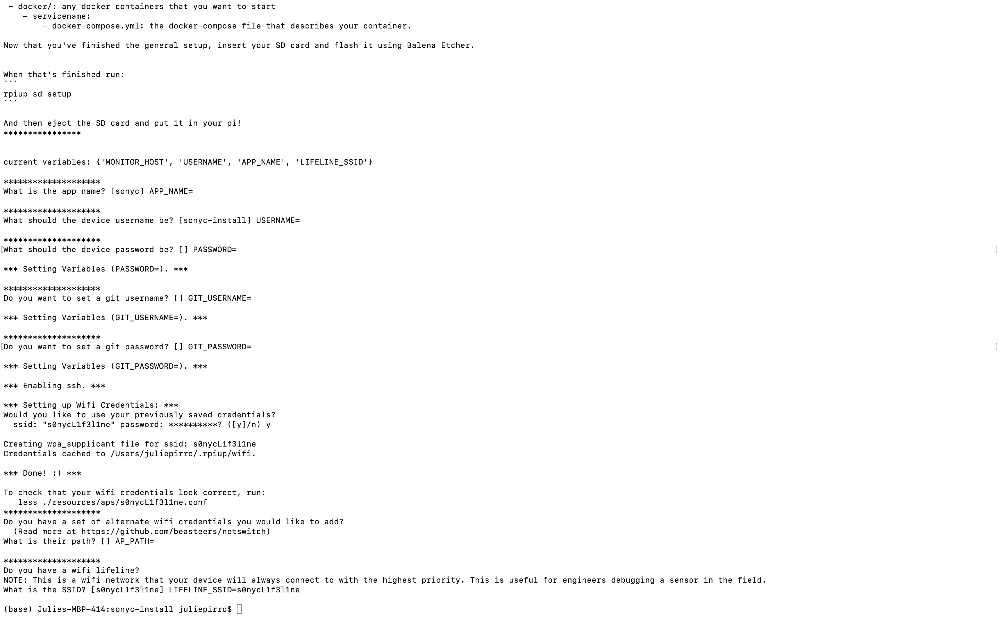

# SONYC TTP Sensor Overview

## TTP Diagram

1. Cellular antenna
2. Microphone
3. Wifi antenna

4. Cellular pie hat
5. Raspberry pi
6. Piwatcher
7. SD Card
8. Power cable
9. USB from pi to cellular hat 

## Setting up a TTP Sensor

### Flashing the SD
Insert the SD into your laptop, and use Balena Etcher to flash the SD
* you will need to download and select the latest Raspbian image

### Wifi Setup
Give the wifi credentials to the sensor
* Hit "Enter" to skip through until it reaches the wifi credentials
* Enter your ssid and password

Generate persistent Unique IDs for identifying the devices, and export as a .tsv file

### Copying code onto the SD
1. Go to the sonycsetup/sonyc-backend/playbooks directory, and do a "git pull"
2. In a different window, go to your /sonycsetup/sonyc-install directory and copy the files onto the SD
  * *make sure to change the ttp-0xx number to the correct one*  

3. Eject the SD and insert into the TTP!

### Hardware Setup

#### Washers

Insert washers directly under the cell hat.

*above are the washers*

To do this, remove both screws from the top of the cell hat and slide the washers in. Place the screws back into the slots and tighten.

**Be sure not to over-tighten the screws, as this will also place too much pressure on the SD card**.

#### Microphone Cable Twist

When opening a new sensor, unplug the microphone and twist the cables around one full clockwise rotation. This prevents strain on the connection when the lid is opened.

*pictured above is a fully powered on sensor before closing the lid*

To close the lid, tighten all 10 screws using an hex key. 

**Be sure not to over-tighten the screws to prevent excess pressure on components**

*above is a completed and closed sensor*

## Shipping a TTP Sensor

Before shipping, place two command strips on the back of the device. 

**Be sure not to peal the wall side of the strips.**
There will also be a custom QR code for each sensor that the user can scan to access their sensor at home.
Each TTP sensor has a unique number identifier. This number will also be placed in the QR code.

Grab a new box, unfold the box, and tape together the bottom side using packing tape.

Every shipment of a TTP node will contain:

1. Sensor
2. Extention chord (* this will be ziptied to the sensor before shipment as pictured *)
3. An extra set of command strips
4. Alcohol cleaning pads for the window
5. Bubble wrap for sensor protection
6. Return shipping label (not pictured)

Place all of the components into the box and tape it shut.

Tape the shipping lable to the top. The team will provide you with the information about shipping at the time of the shipment.

## Deploying a TTP Sensor
When you get to the location:
1. Use the alcohol wipes to clean the surface of the window
2. Peel off the "wall side" of the command strips
3. Stick the TTP onto the window
4. Plug it in
5. Use these commands (below) to change the name of the sensor and status to "Active" on the dashboard

* use the sensor's FQDN, found on the dashboard
* it will prompt for a name for the location

* use the sensor's deployment_id, which can be found in output code from the previous command
  
6. Check the dashboard to make sure the name and sensor status are updated!

