# SONYC TTP Sensor Refurbishment Process
Process for repairing and cleaning sensors to get ready for a new deployment

## Refurbishment Checklist:
1. In Cockpit:
    - mark down the lifestage of the TTP as “Under Construction” 
    - Rename the node as its original number (ex: "TTP-000") 
    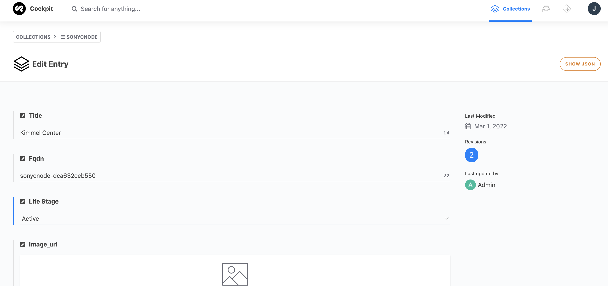 
    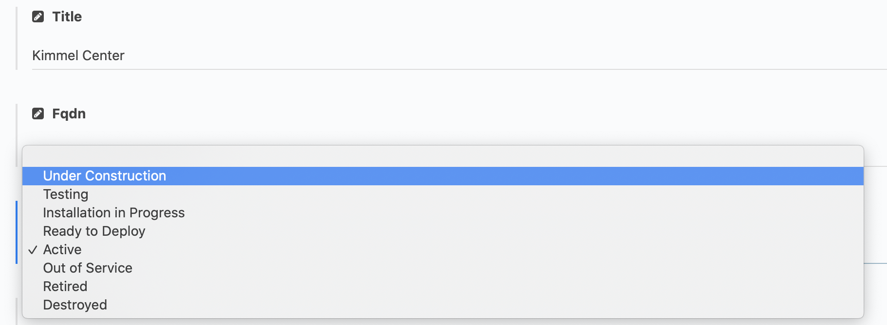
    

2. Clean the TTP exterior:
    - Clean outside with cleaner and paper towel/clorox wipe
    - Wipe down a few times until there is no visible residue on the towel
  
3. Clean the wind screen (show picture)
    - Remove the foam piece 
      - If the foam is noticeably dirty, replace it
    - Clean the windscreen from the outside with compressed air, making sure not to puncture it! 
      - If the windscreen is damaged in any way, replace it
    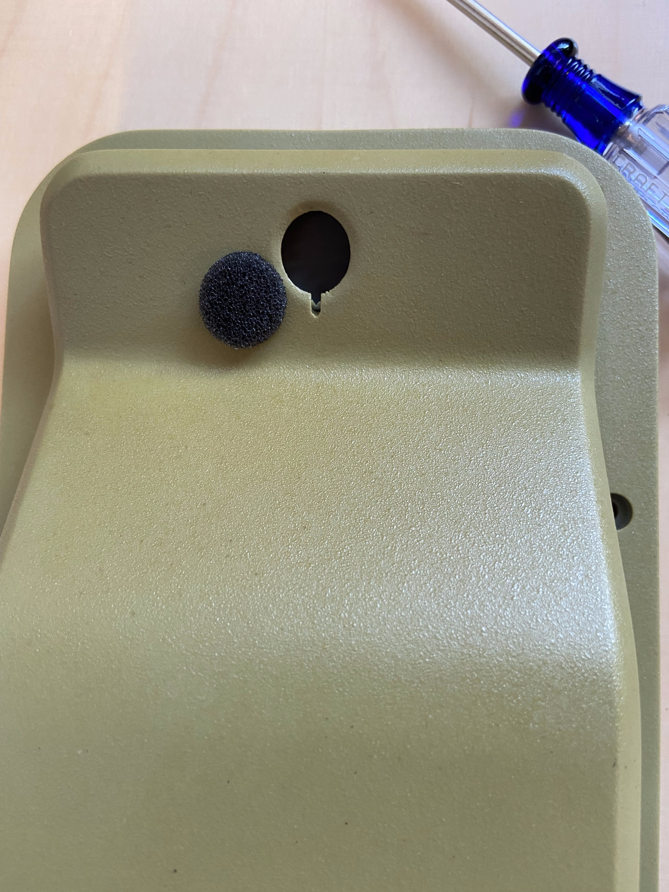

4. Check to see if TTP is working on the dashboard. If not, check the following:
    - Is the Pi getting power? 
      - You should see a solid red light and flashing green light on the pi itself. The cell hat consistently blinks blue.
      - <a href="https://drive.google.com/file/d/12KVkUHhisbTPMBmKYQkbMs-nWwfqD3gm/view?usp=sharing" title="Pi Lights Blinking">Pi Lights Blinking </a>
  

5. If not, check that the outlet works, the pi is plugged in, and any extension cables also work
    - Is the sonyc lifeline router on?
    - Are any wires loose? (particularly the mic or power cable)

5. Replace any missing TTP screws or washers

7. Tape down twisted mic cables
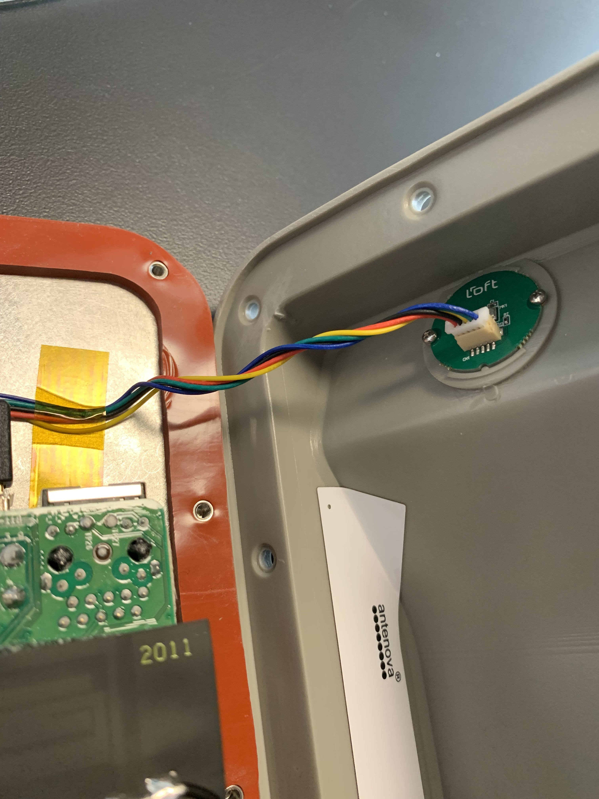

8. Perform any necessary repairs

## Possible Repairs:
#### Broken cell hat antenna cable 
Solder the cable back together to the clip

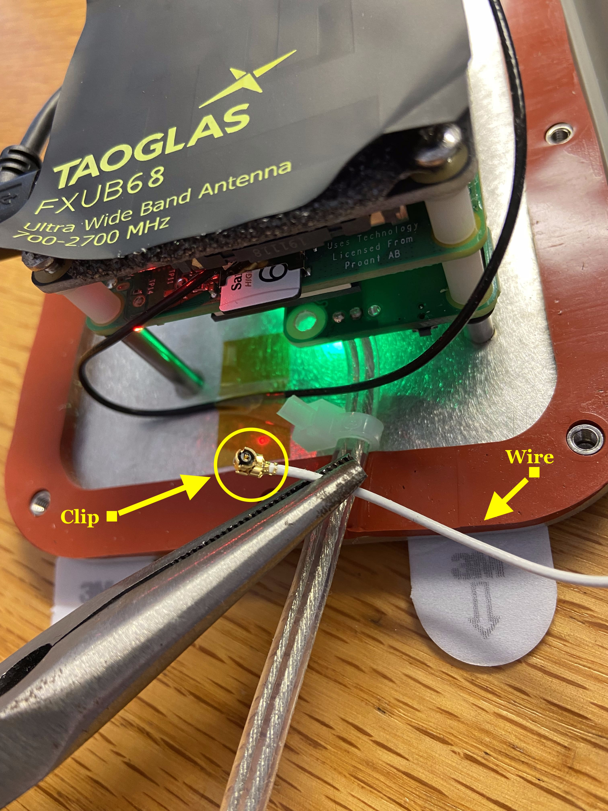

*If that doesn't work, replace with a different housing top*

Ensure black and white wires are plugged into proper places (see picture below) 

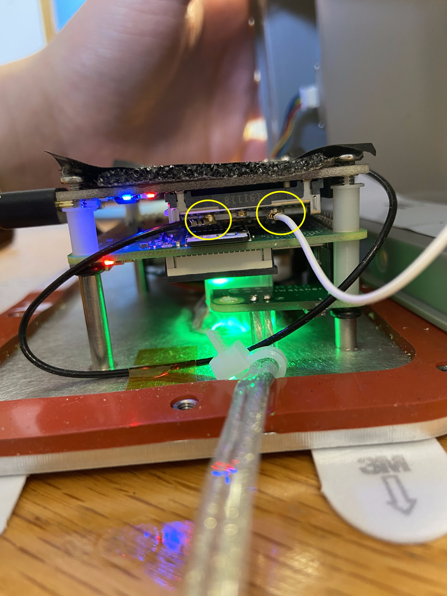

#### Replacing housing top:
Unplug TTP

Unplug white cell antenna wire from the Pi

Unplug the microphone from the housing lid

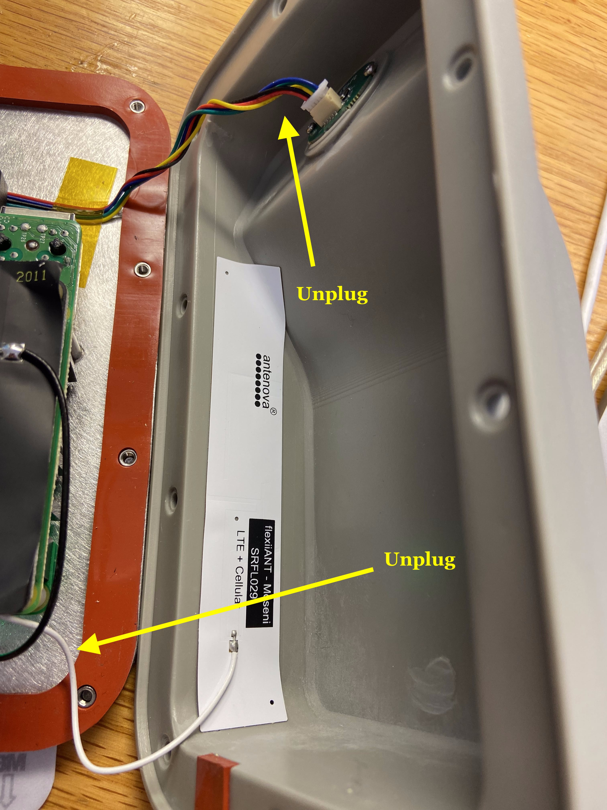

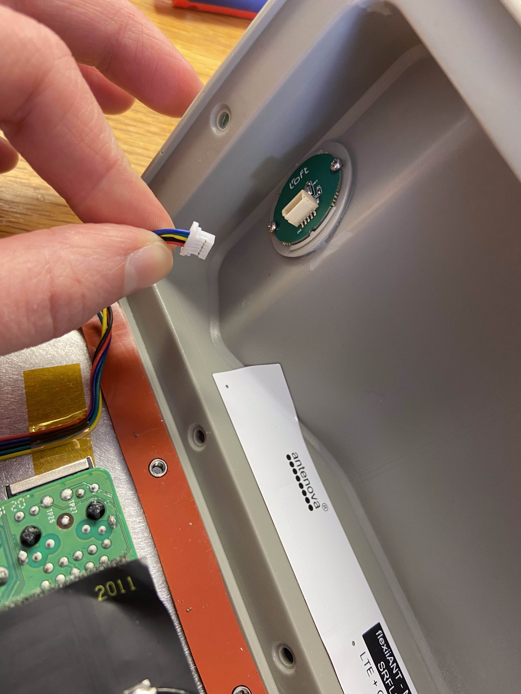

Swap housing tops

Plug mic cable and antenna cable back in

Plug TTP back in and make sure it comes up on the dashboard!

#### Replacing a punctured windscreen:
Remove the foam piece from the outside of the TTP housing

From the inside of the housing, unplug the microphone.

Unscrew the two screws holding the green mic board in place to reveal the windscreen

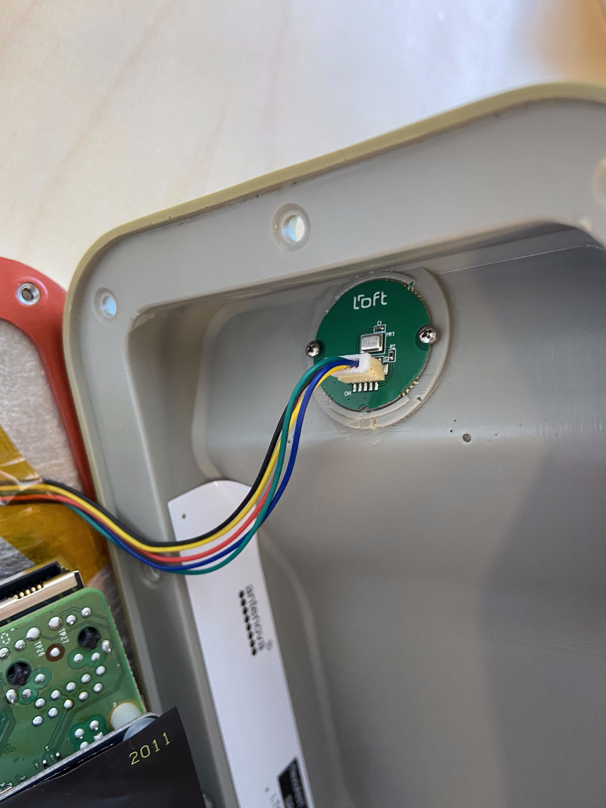

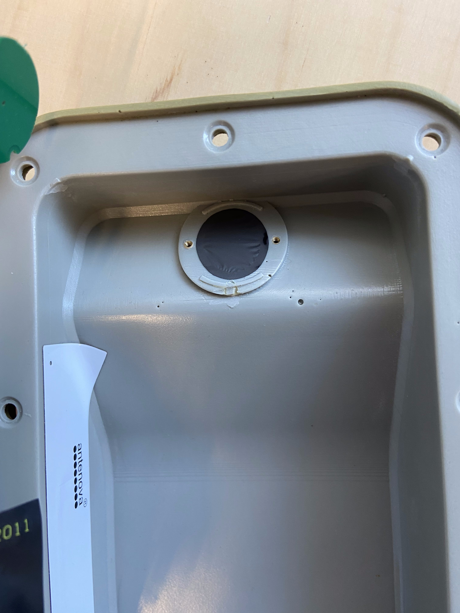

Gently peel off the old windscreen, and stick the new windscreen in the same place

Shine a flashlight through the windscreen to make sure there are no holes or gaps

Screw the green mic board back in place, and plug the mic back in 

Place the foam piece back 

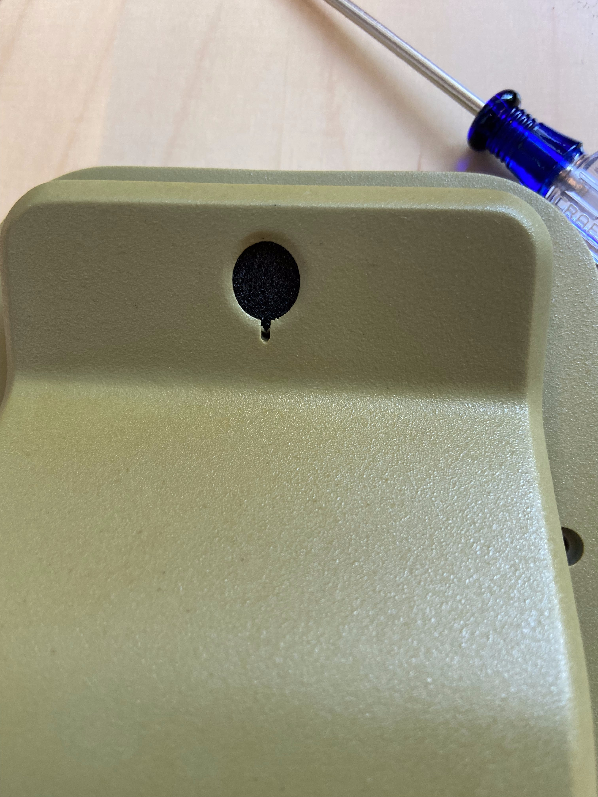

## Getting Ready for Re-Deployment:
1. Clean TTP
2. Make all necessary repairs/replacements
3. Ensure the TTP comes up as working on the dashboard
4. Put 2 command strips on it
5. Plug in and zip tie an extension cord to the power usb
6. Print out QR codes and place on back
7. Pack in box with bubble wrap and alcohol strips
8. In Cockpit:
    - Rename the TTP to where it is going
    - mark down the life stage as “active”

